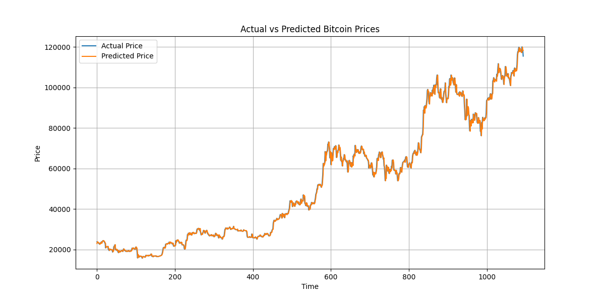

# BTC Price Prediction System

## Overview
This project predicts Bitcoin prices using Linear Regression based on historical data.

## Features
- Data preprocessing
- Feature engineering (lag values, year, month)
- Data visualization
- Price prediction model

## Technologies Used
- Python
- Pandas
- NumPy
- Matplotlib
- Scikit-learn

## How to Run

1. Install dependencies:
pip install -r requirements.txt

2. Run the program:
python main.py

## Dataset
Bitcoin historical price dataset (2010–2025)

## Limitations
- Uses basic Linear Regression
- Does not consider real-world market factors

## Future Improvements
- LSTM / Deep Learning models
- Real-time API integration

## 📊 Prediction Output

